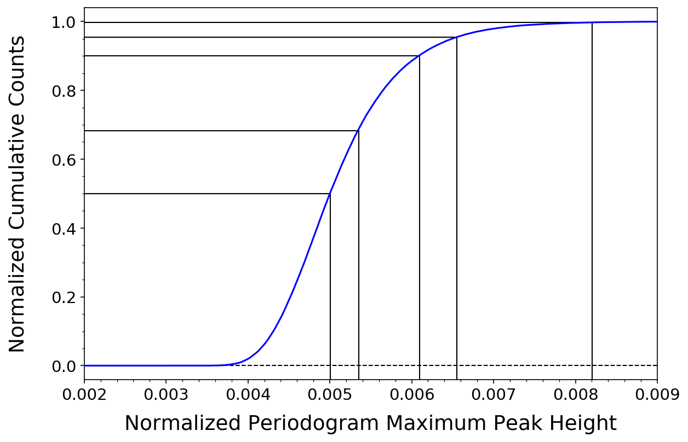

# K2 Space Mission Time Series Analysis of the Variable Asynchronous Polar SDSS J084617.12+245344.1

D. W. Hoard et al., 2019, in progress

**Summary:**
Processing and analysis of a combined data set containing more than 3800 multivariate (n>10) points for a single target drawn primarily from the NASA K2 mission database.

**Description of the data:**
The data set is a time series of photometric brightness measurements of a variable star (a semi-detached, interacting binary) obtained at a cadence of aproximately 1 measurement every 30 minutes, continuously for 79.5 consecutive days. Each measurement produced a 7-dimensional data point comprised of: time, brightness and associated uncertainty, X & Y position on the detector, and two quality assessments. Pre-processing of the data deconvolved the brightness measurement into three additional components: the time-variable flux, the position-dependent flux, and a flux residual. 

The data processing and analysis steps are described in more detail in the *k2timeseries* Jupyter Notebook, which is stored in this repository (along with a sample data file (EPIC_212218649_sap_mast-kepconvert.txt) that can be used to run *k2timeseries*. The *output* folder, which should be contained in the same directory where the notebook is being run, currently contains a sample file of Monte Carlo simulation results which can be used to determine the periodogram false alarm probabilities. This file can also be constructed using *k2timeseries*, but that step can be time consuming. Output files (data visualizations) created by *k2timeseries* are written into the *output* folder. The *sample_output* folder contains copies of the expected output files.

**Skills:**
- Retrieving, cleaning, and combining data from multiple database sources (Python)
- Construction of original code to perform time series analysis to identify periodic and non-periodic trends and behavior (Lomb-Scargle periodogram technique, with Monte Carlo simulation utilizing multiprocessor threading to assess the false alarm probability; Python/Jupyter Notebooks )
- Assessment of reliability of results through A/B testing, random subset comparison, "uninteresting" target comparison, etc. (Python/Jupyter Notebooks) 
- Data visualization (Python/Jupyter Notebooks)
- Reporting of procedures and results (scientific/technical writing and documentation)

**Sample Data Visualization:**

